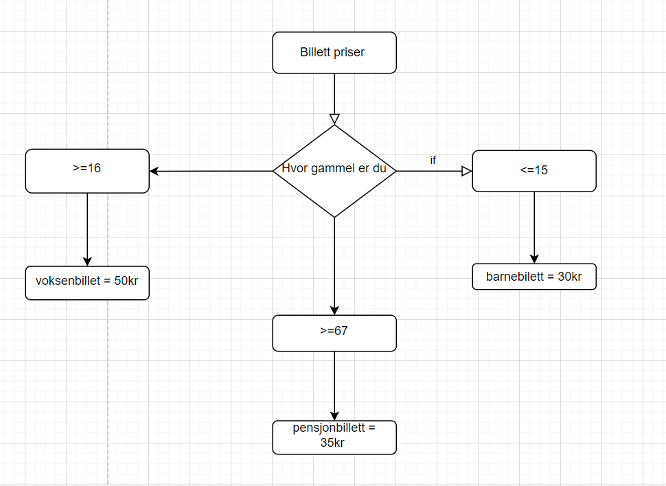

## Oppgave 1: V23-1
Hva er en while-løkke i programmering? (ett riktig svar)

 en løkke som kjører til en bestemt hendelse intreffer

## Oppgave 2: H23-2
Hvilken av de følgende påstandene er riktig om for- og while-løkker innen programmering? Velg riktig alternativ.

 en for-løkke er best egnet når du vet hvor mange ganger du vil at løkken skal kjøre
 en while-løkke kan ikke bruke en teller for å holde rede på hvor mange ganger den har kjørt

## Oppgave 3: H23-3

Hva er hovedprinsippet bak objektorientert programmering (OOP)? Velg riktig alternativ.

 å representere data og funksjoner som objekter

## Oppgave 4: H23-1
Hvilket av følgende er ikke et typisk kjennetegn på pseudokode? Velg riktig alternativ.

 den kan kjøres direkte på en datamaskin.

## Oppgave 5: V23-2

Ta utgangspunkt i den følgende pseudokoden:

SET m TO 3
SET i TO 1
WHILE i GREATER THAN m
  DISPLAY "Lykkelig dag!"
  INCREMENT i
ENDWHILE
Hvor mange ganger blir teksten "Lykkelig dag!" skrevet ut?

 to ganger

## Oppgave 6: H23-4

Hvilke av de følgende sekvensene med pseudokode skriver ut tallene fra og med 1 til og med 5? Flere alternativer kan være riktige. Velg riktige svar.

1.
SET i TO 1
FOR hver i LESSER OR EQUAL 5
  PRINT i
ENDFOR

2.
SET i TO 1
WHILE i < 5
  PRINT i
  INCREMENT i 
ENDWHILE

3.
SET i TO 0
FOR hver i LESSER OR EQUAL 4
  PRINT i+1
ENDFOR

4.
SET i TO 1
WHILE i <= 5
  PRINT i
  INCREMENT i BY 2
ENDWHILE
 1
 4

## Oppgave 7: H23-5

